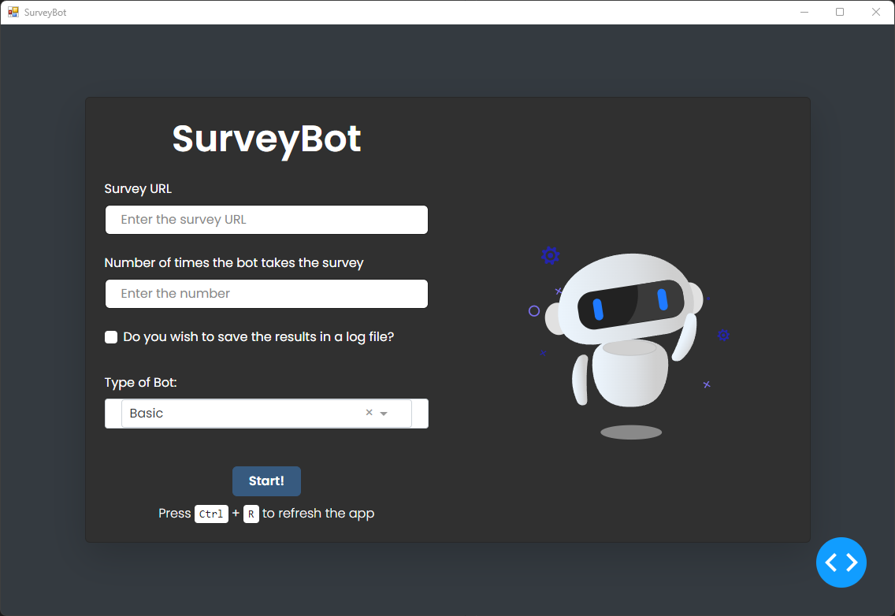

# SurveyBot
SurveyBot is a pretesting tool for surveys to make sure that there are no technical problems. For that, SurveyBot can run several trials at once, giving the choice between different levels of "intelligence":
- A *Basic* version randomly chooses answers based on available options.
- A *Medium-I* variant can also solve CAPTCHAs using an LLM.
- A *Medium-II* bot that uses the LLM to answer the questions (instead of just random choices).
- And an *Advanced* bot that creates different character profiles to simulate different users.

Logs can be saved for each run to understand which parts of the survey have been seen and what the bot clicked or inputted.

## Usage
This repository provides a Windows executable (in the SurveyBot.zip*) for running the bot directly. The executable was compiled using a 10th-generation Intel CPU on Windows 10. Hence, the program should run on similar or better systems.

Upon opening the executable, the user is greeted with a simple frontend containing the configuration options:
1) **Survey URL:** Here, the survey URL to be tested must be inserted. Currently, the bot was only implemented with [Unipark](https://www.unipark.com/en/) survey types in mind. However, it might also work for other surveys, though there is no guarantee.
2) **Number of times the bot takes the survey:** This option tells the bot on how many times the survey should be run. Each run will be independent from the previous one and will be executed consecutively.
3) **Do you wish to save the results in a log file?:** If this checkbox is ticked, a sub-folder with the corresponding bot name is created, where for each run a log file is created, that details what the bot did and saw at each part of the survey.
4) **Type of Bot:** Here, the type of bot (as described above) is chosen. When clicking on a bot other than *Basic* additional input fields will appear:
    * **Gemini API Key:** Since the bots use an LLM for solving CAPTCHAS and, in higher versions, also answering the queries, a key for Gemini is needed since we are using its capabilities. The application links how to generate a key and can be found [here](https://ai.google.dev/gemini-api/docs/api-key).
    * **Email generator API Key:** Some surveys require inputting Email addresses. Hence, actual email addresses are generated using an API. A key to this API can be acquired [here](https://rapidapi.com/vikashkhati007/api/temporary-email-generator/playground/apiendpoint_7bedaff8-ee97-44e4-808f-fff01fef18af).
5) **Start:** Clicking on this button will run the bot. This means that a Chrome Browser will be opened that will conduct the given survey. It is advised not to use the PC during that time. This is especially true for the Advanced bot since it generates mouse movements.
